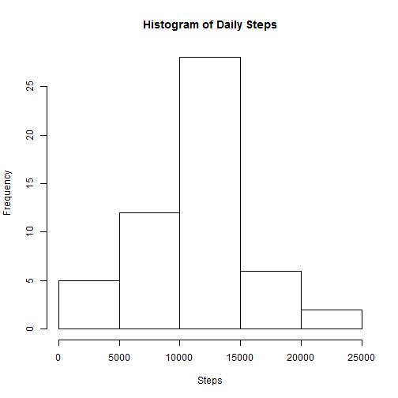
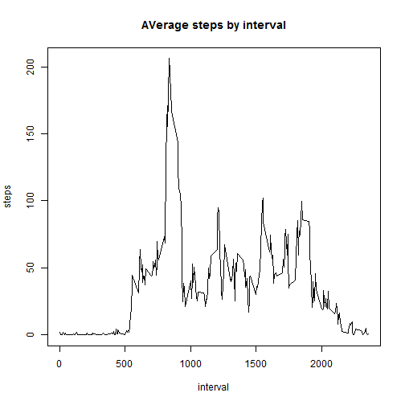
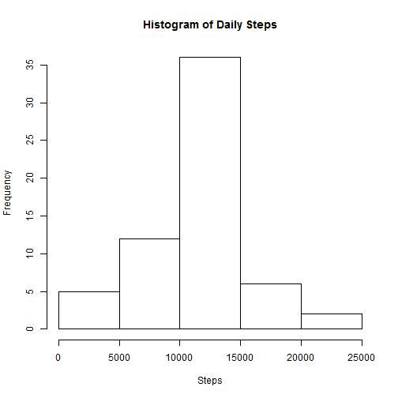
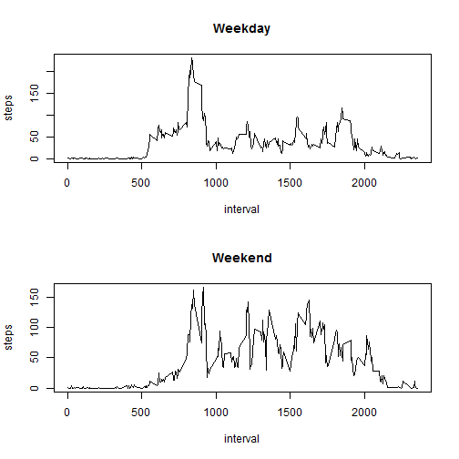

Activity Monitoring Assignment
==============================

#Loading and preprocessing the data

Set working directory and load the data.


```r
setwd("C:/Users/Stephen Spitz/Desktop")
data<-read.csv("activity.csv")
```

#What is the mean total number of steps taken per day?

Calculate the total number of steps.


```r
sum(data$steps,na.rm=TRUE)
```

```
## [1] 570608
```

Aggregate the data by date and plot a histogram of the total number of steps.


```r
hist(aggregate(list(steps=data$steps),by=list(date=data$date),sum)$steps,xlab="Steps",ylab="Frequency",main="Histogram of Daily Steps")
```



Calculate the mean and median of total daily steps.


```r
mean(aggregate(list(steps=data$steps),by=list(date=data$date),sum)$steps,na.rm=TRUE)
```

```
## [1] 10766.19
```

```r
median(aggregate(list(steps=data$steps),by=list(date=data$date),sum)$steps,na.rm=TRUE)
```

```
## [1] 10765
```

#What is the average daily activity pattern?


Average steps in each interval over all the days.


```r
plot(aggregate(list(steps=data$steps),by=list(interval=data$interval),mean,na.rm=TRUE),type="l",main="AVerage steps by interval")
```



Find the interval with the maximum average


```r
aggregate(list(steps=data$steps),by=list(interval=data$interval),mean,na.rm=TRUE)$interval[[which.max(aggregate(list(steps=data$steps),by=list(interval=data$interval),mean,na.rm=TRUE)$steps)]]
```

```
## [1] 835
```

#Imputing Missing Values

Find the total number of missing rows.


```r
sum(is.na(data$steps))
```

```
## [1] 2304
```

Impute missing values using the average for the given interval.


```r
newdata<-data

for(i in 1:length(data$steps)){
if(is.na(data$steps[i])==TRUE){
newdata[i,1]<-subset(aggregate(list(steps=data$steps),by=list(interval=data$interval),mean,na.rm=TRUE),interval==data[i,3])[1,2]}
}
```

Histogram of total steps taken each day.


```r
hist(aggregate(list(steps=newdata$steps),by=list(date=newdata$date),sum)$steps,xlab="Steps",ylab="Frequency",main="Histogram of Daily Steps")
```



Calculate the mean and median of total daily steps.  Imputing the missing values barely resulted in any change.


```r
mean(aggregate(list(steps=newdata$steps),by=list(date=newdata$date),sum)$steps,na.rm=TRUE)
```

```
## [1] 10766.19
```

```r
median(aggregate(list(steps=newdata$steps),by=list(date=newdata$date),sum)$steps,na.rm=TRUE)
```

```
## [1] 10766.19
```

#Are there differences in activity patterns between weekdays and weekends?

Create a new factor variable indicating weekend or weekday.


```r
weekend<-function(var){if(weekdays(as.Date(var))=="Saturday"||weekdays(as.Date(var))=="Sunday") "Weekend" else "Weekday"}

newdata$day<-sapply(newdata$date,FUN=weekend)
```

Create a plot comparing average steps for a given interval on a weekend vs a weekday.


```r
par(mfrow=c(2,1))

plot(subset(aggregate(list(steps=newdata$steps),by=list(interval=newdata$interval,day=newdata$day),mean,na.rm=TRUE),aggregate(list(steps=newdata$steps),by=list(interval=newdata$interval,day=newdata$day),mean,na.rm=TRUE)$day=="Weekday",select=c(1,3)),type="l",main="Weekday")

plot(subset(aggregate(list(steps=newdata$steps),by=list(interval=newdata$interval,day=newdata$day),mean,na.rm=TRUE),aggregate(list(steps=newdata$steps),by=list(interval=newdata$interval,day=newdata$day),mean,na.rm=TRUE)$day=="Weekend",select=c(1,3)),type="l",main="Weekend")
```


